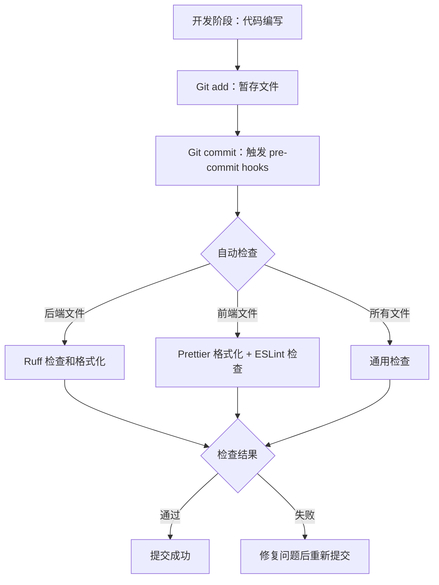
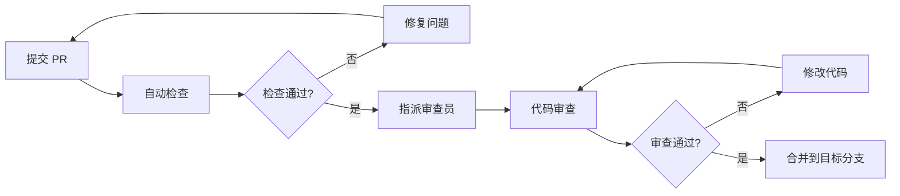

# 代码审查指南（Code Review Guide, v1.0）

> 本文档为代码审查员提供全面的审查标准和最佳实践

---

## 目录

1. [Pre-commit 配置详解](#1-pre-commit-配置详解)
2. [安装和使用](#2-安装和使用)
3. [最佳实践](#3-最佳实践)
4. [团队协作规范](#4-团队协作规范)
5. [工具链维护](#5-工具链维护)
6. [审计与追踪](#6-审计与追踪)
7. [附录](#7-附录)

---

## 1. Pre-commit 配置详解

### 1.1 配置结构

```yaml
repos:
  # 后端 Python 检查（仅 backend/）
  - repo: https://github.com/astral-sh/ruff-pre-commit
    rev: v0.14.10
    hooks:
      - id: ruff-check # Lint 检查
        args: [--fix]
        files: ^backend/
      - id: ruff-format # 代码格式化
        files: ^backend/

  # 前端格式化（仅 frontend/）
  - repo: https://github.com/pre-commit/mirrors-prettier
    rev: v4.0.0-alpha.8
    hooks:
      - id: prettier
        files: ^frontend/
        args: [--write]

  # 前端 Lint（仅 frontend/）
  - repo: https://github.com/pre-commit/mirrors-eslint
    rev: v9.15.0
    hooks:
      - id: eslint
        files: ^frontend/
        args: [--fix]

  # 通用检查（全仓库）
  - repo: https://github.com/pre-commit/pre-commit-hooks
    rev: v5.0.0
    hooks:
      - id: check-yaml
        exclude: ^.vscode/
      - id: check-toml
      - id: check-json
      - id: end-of-file-fixer
      - id: trailing-whitespace
      - id: detect-private-key
      - id: check-added-large-files
        args: [--maxkb=500]
```

### 1.2 工作流程



**流程说明：**

1. **开发阶段**：代码编写
2. **Git add**：暂存文件
3. **Git commit**：触发 pre-commit hooks
4. **自动检查**：
   - 后端文件 → Ruff 检查和格式化
   - 前端文件 → Prettier 格式化 + ESLint 检查
   - 所有文件 → 通用检查（YAML/JSON/TOML/大文件等）
5. **检查通过**：提交成功
6. **检查失败**：修复问题后重新提交

### 1.3 检查范围说明

| 工具                        | 检查范围                                    | 作用                      |
| --------------------------- | ------------------------------------------- | ------------------------- |
| **Ruff**                    | `backend/**/*.py`                           | Python 代码 Lint 和格式化 |
| **Prettier**                | `frontend/**/*.{ts,tsx,js,jsx,css,json,md}` | 前端代码格式化            |
| **ESLint**                  | `frontend/**/*.{ts,tsx,js,jsx}`             | 前端代码质量检查          |
| **check-yaml**              | `**/*.yaml`, `**/*.yml` (除 .vscode/)       | YAML 格式验证             |
| **check-json**              | `**/*.json`                                 | JSON 格式验证             |
| **check-toml**              | `**/*.toml`                                 | TOML 格式验证             |
| **trailing-whitespace**     | 所有文本文件                                | 移除行尾空格              |
| **end-of-file-fixer**       | 所有文本文件                                | 确保文件末尾换行          |
| **detect-private-key**      | 所有文件                                    | 检测私钥泄露              |
| **check-added-large-files** | 所有文件                                    | 防止大文件提交（>500KB）  |

---

## 2. 安装和使用

### 2.1 初始化 Pre-commit

```bash
# 安装 pre-commit
pip install pre-commit

# 安装 git hooks
pre-commit install --install-hooks

# 首次运行，检查所有文件
pre-commit run --all-files
```

### 2.2 后端开发流程

```bash
# 1. 编写代码
# 2. 运行格式化和检查
cd backend
ruff check . --fix
ruff format .

# 3. 提交代码（会自动触发 pre-commit）
git add .
git commit -m "feat: add user service"
```

### 2.3 前端开发流程

```bash
# 1. 编写代码
# 2. 运行格式化和检查
cd frontend
pnpm run lint
pnpm run format

# 3. 提交代码（会自动触发 pre-commit）
git add .
git commit -m "feat: add user profile component"
```

### 2.4 跳过 Pre-commit（紧急情况）

```bash
# 仅在紧急情况下使用，不推荐
git commit --no-verify -m "hotfix: urgent fix"

# 跳过特定 hook
SKIP=eslint git commit -m "skip eslint check"

# 跳过多个 hooks
SKIP=eslint,prettier git commit -m "skip multiple checks"
```

⚠️ **警告**：跳过检查应该仅用于紧急修复，事后必须补充完整的代码审查。

---

## 3. 最佳实践

### 3.1 代码审查清单

#### 后端（Python）审查清单

- [ ] **ACAP 注释完整性**

  - [ ] 所有 public 函数包含完整 ACAP 注释
  - [ ] Preconditions 明确列出前提条件
  - [ ] Side Effects 明确列出副作用或标注 None
  - [ ] Error Semantics 列出所有可能异常

- [ ] **代码质量**

  - [ ] 函数圈复杂度符合要求（AI: ≤7, 人工: ≤10）
  - [ ] 函数行数 ≤ 50
  - [ ] 无泛化函数名（process, handle, do, run, logic）
  - [ ] 命名清晰，使用描述性动词+名词

- [ ] **AI 标记**

  - [ ] AI 生成代码包含标记（GENERATED_BY_AI, MODEL, DATE）
  - [ ] 标记信息准确完整

- [ ] **类型提示**

  - [ ] 函数参数包含类型提示
  - [ ] 返回值包含类型提示
  - [ ] 复杂类型使用 typing 模块

- [ ] **错误处理**

  - [ ] 异常处理合理
  - [ ] 错误信息清晰
  - [ ] 不吞噬异常

- [ ] **Ruff 检查**
  - [ ] 通过 `ruff check .` 检查
  - [ ] 通过 `ruff format .` 格式化

#### 前端（TypeScript/React - Next.js）审查清单

- [ ] **JSDoc 注释完整性**

  - [ ] 复杂组件包含 JSDoc 注释
  - [ ] 自定义 Hooks 包含完整文档
  - [ ] @preconditions, @sideEffects, @errorHandling 标注清晰

- [ ] **组件质量**

  - [ ] 组件大小合理（≤ 300 行）
  - [ ] 职责单一，功能明确
  - [ ] Props 类型定义完整
  - [ ] 组件命名使用 PascalCase

- [ ] **状态管理（Zustand）**

  - [ ] 简单状态使用 useState
  - [ ] 复杂/跨组件状态使用 Zustand
  - [ ] 持久化状态使用 persist 中间件
  - [ ] 避免不必要的状态提升

- [ ] **类型安全**

  - [ ] Props 接口定义完整
  - [ ] 避免使用 any 类型
  - [ ] 使用 `type` 导入（consistent-type-imports）
  - [ ] 通过 TypeScript 类型检查

- [ ] **AI 标记**

  - [ ] AI 生成代码包含标记（// GENERATED_BY_AI）
  - [ ] 标记信息准确完整

- [ ] **代码规范**

  - [ ] 通过 ESLint 检查（`pnpm run lint`）
  - [ ] 通过 Prettier 格式化（`pnpm run format`）
  - [ ] 无 console.log 等调试代码（只允许 warn/error）
  - [ ] 使用 TailwindCSS 4 样式，避免内联 style

- [ ] **性能考虑**

  - [ ] 合理使用 useMemo/useCallback
  - [ ] 避免不必要的重渲染
  - [ ] 使用 next/image 替代 img 标签
  - [ ] 列表渲染使用 key

- [ ] **Next.js 特定**
  - [ ] 使用 App Router 约定（layout.tsx, page.tsx）
  - [ ] 正确区分 Server/Client Components
  - [ ] API Routes 放在 app/api 目录

#### 前端（TypeScript/Vue）审查清单

- [ ] **组件质量**

  - [ ] 组件大小合理（≤ 300 行）
  - [ ] 使用 Composition API（setup）
  - [ ] Props 使用 defineProps 定义类型
  - [ ] 组件命名使用 PascalCase

- [ ] **状态管理（Pinia）**

  - [ ] 局部状态使用 ref/reactive
  - [ ] 跨组件状态使用 Pinia Store
  - [ ] 持久化状态使用 pinia-plugin-persistedstate
  - [ ] Store 按模块划分（stores/modules/）

- [ ] **Composables（Hooks）**

  - [ ] 业务逻辑封装到 hooks/ 目录
  - [ ] 命名使用 use 前缀（usePaged, useKeyPress）
  - [ ] 返回响应式数据和方法

- [ ] **类型安全**

  - [ ] 使用 `type` 导入（consistent-type-imports）
  - [ ] 接口类型放在 types/ 目录
  - [ ] API 响应类型在 api/interface/ 定义

- [ ] **代码规范**

  - [ ] 通过 Oxlint 预检查（`pnpm run lint:oxlint`）
  - [ ] 通过 ESLint 检查（`pnpm run lint:eslint`）
  - [ ] 通过 Prettier 格式化（`pnpm run format`）
  - [ ] 导入排序正确（simple-import-sort）

- [ ] **样式规范**

  - [ ] 使用 UnoCSS 原子类
  - [ ] Less 变量定义在 styles/var.less
  - [ ] 组件样式使用 scoped

- [ ] **性能考虑**
  - [ ] 合理使用 computed
  - [ ] 避免不必要的响应式转换
  - [ ] 列表渲染使用 :key

### 3.2 常见问题与解决方案

#### Q1: Pre-commit 检查太慢怎么办？

**问题**：提交时 pre-commit 检查耗时过长

**解决方案**：

```bash
# 方案 1: 只检查暂存的文件
git add specific-file.py
git commit  # 只检查 specific-file.py

# 方案 2: 使用增量检查
pre-commit run --files $(git diff --cached --name-only)

# 方案 3: 优化 pre-commit 配置
# 在 .pre-commit-config.yaml 中添加 stages 配置
```

#### Q2: 如何临时禁用某个 hook？

**问题**：某些情况下需要临时跳过特定检查

**解决方案**：

```bash
# 跳过单个 hook
SKIP=eslint git commit -m "skip eslint"

# 跳过多个 hooks
SKIP=eslint,prettier git commit -m "skip multiple checks"

# 完全跳过 pre-commit（不推荐）
git commit --no-verify -m "emergency fix"
```

⚠️ **注意**：跳过检查后应在 PR 中说明原因，并在后续补充完整检查。

#### Q3: Ruff 和 ESLint 冲突怎么办？

**问题**：担心 Ruff 和 ESLint 规则冲突

**解决方案**：
配置文件已经隔离，不会冲突：

- Ruff 只检查 `backend/` 目录
- ESLint 只检查 `frontend/` 目录
- 各自独立运行，互不干扰

#### Q4: 如何更新 pre-commit hooks？

**问题**：hooks 版本过旧，需要更新

**解决方案**：

```bash
# 自动更新到最新版本
pre-commit autoupdate

# 重新安装 hooks
pre-commit install --install-hooks

# 测试更新后的配置
pre-commit run --all-files
```

#### Q5: 代码格式化后与团队风格不一致？

**问题**：自动格式化后的代码风格与团队习惯不符

**解决方案**：

```bash
# 后端：修改 backend/pyproject.toml 中的 Ruff 配置
# 前端：修改 frontend/.prettierrc 和 frontend/eslint.config.js

# 修改后重新运行格式化
cd backend && ruff format .
cd frontend && pnpm run format
```

### 3.3 审查优先级

按重要性排序的审查重点：

**🔴 高优先级（必须检查）**

1. 安全问题（SQL 注入、XSS、敏感信息泄露）
2. 功能正确性（是否实现需求）
3. 错误处理（异常捕获、边界条件）
4. 性能问题（N+1 查询、内存泄漏）

**🟡 中优先级（建议检查）**

1. 代码规范（命名、格式、注释）
2. 类型安全（类型提示、类型检查）
3. 测试覆盖（关键功能是否有测试）
4. 文档完整性（README、API 文档）

**🟢 低优先级（可选检查）**

1. 代码优化（可读性改进）
2. 重构建议（设计模式应用）
3. 性能优化（非关键路径）

---

## 4. 团队协作规范

### 4.1 Commit Message 规范

遵循 **Conventional Commits** 标准：

```
<type>(<scope>): <subject>

<body>

<footer>
```

#### Type 类型

| Type       | 说明      | 示例                                       |
| ---------- | --------- | ------------------------------------------ |
| `feat`     | 新功能    | `feat(auth): add JWT token refresh`        |
| `fix`      | Bug 修复  | `fix(user): resolve email validation bug`  |
| `docs`     | 文档更新  | `docs(api): update API documentation`      |
| `style`    | 代码格式  | `style: format code with prettier`         |
| `refactor` | 重构      | `refactor(user): simplify user validation` |
| `perf`     | 性能优化  | `perf(query): optimize database query`     |
| `test`     | 测试相关  | `test(auth): add login test cases`         |
| `chore`    | 构建/工具 | `chore: update dependencies`               |

#### Scope 范围

常用 scope 示例：

- `auth`: 认证相关
- `user`: 用户模块
- `api`: API 接口
- `ui`: 用户界面
- `db`: 数据库
- `config`: 配置相关

#### Subject 主题

- 使用祈使句，现在时态
- 首字母小写
- 结尾不加句号
- 简洁明了，不超过 50 个字符

#### 完整示例

```bash
feat(auth): add JWT token refresh mechanism

- Implement refresh token endpoint
- Add token expiration validation
- Update authentication middleware

Closes #123
```

### 4.2 分支策略

```
main          # 生产环境（受保护）
  ↑
develop       # 开发环境（集成分支）
  ↑
feature/*     # 功能分支
hotfix/*      # 紧急修复分支
release/*     # 发布分支（可选）
```

#### 分支命名规范

```bash
# 功能分支
feature/user-authentication
feature/data-export

# 修复分支
hotfix/security-vulnerability
hotfix/critical-bug

# 发布分支
release/v1.2.0
```

### 4.3 Pull Request 规范

#### PR 标题

遵循 Commit Message 规范：

```
feat(auth): add OAuth2 support
```

#### PR 描述模板

```markdown
## 变更类型

- [ ] 新功能
- [ ] Bug 修复
- [ ] 重构
- [ ] 文档更新
- [ ] 其他

## 变更说明

简要描述本次变更的内容和原因

## 测试说明

- [ ] 已添加单元测试
- [ ] 已添加集成测试
- [ ] 已手动测试

## 检查清单

- [ ] 代码通过所有 pre-commit 检查
- [ ] 已更新相关文档
- [ ] 已添加必要的注释
- [ ] 无 breaking changes（或已在文档中说明）

## 相关 Issue

Closes #123
Related to #456
```

### 4.4 Code Review 流程



#### 审查员职责

1. **及时响应**：24 小时内完成首次审查
2. **全面检查**：使用审查清单逐项检查
3. **建设性反馈**：提供具体的改进建议
4. **知识分享**：解释审查意见的原因

#### 提交者职责

1. **自我审查**：提交前先自己审查一遍
2. **及时响应**：尽快回应审查意见
3. **虚心接受**：认真对待审查反馈
4. **持续改进**：从审查中学习提升

---

## 5. 工具链维护

### 5.1 版本更新策略

| 工具                 | 更新频率     | 更新方式                |
| -------------------- | ------------ | ----------------------- |
| **Ruff**             | 每季度       | `pre-commit autoupdate` |
| **ESLint**           | 跟随项目需求 | `pnpm update eslint`    |
| **Prettier**         | 保持稳定版本 | 谨慎更新                |
| **pre-commit-hooks** | 每半年       | `pre-commit autoupdate` |

### 5.2 配置文件位置

```
ai-fullstack/
├── .pre-commit-config.yaml         # Pre-commit 主配置
├── backend/
│   ├── pyproject.toml              # Ruff 配置
│   └── .scripts/
│       ├── generate_acap_docstring.py
│       └── check_acap_docstring.py
├── frontend/
│   ├── portal-nextjs/              # Next.js 项目
│   │   ├── eslint.config.mjs       # ESLint 配置
│   │   ├── .prettierrc             # Prettier 配置
│   │   ├── tsconfig.json           # TypeScript 配置
│   │   ├── tailwind.config.mjs     # TailwindCSS 4 配置
│   │   ├── next.config.mjs         # Next.js 配置
│   │   ├── .husky/                 # Git Hooks
│   │   └── prisma/                 # Prisma Schema
│   └── portal-vue/                 # Vue 项目
│       ├── eslint.config.ts        # ESLint 配置
│       ├── .prettierrc.json        # Prettier 配置
│       ├── tsconfig.app.json       # TypeScript 配置
│       ├── uno.config.ts           # UnoCSS 配置
│       ├── vite.config.ts          # Vite 配置
│       ├── vitest.config.ts        # Vitest 配置
│       └── playwright.config.ts    # Playwright 配置
└── .fullstackrules/
    ├── AI_Code_Engineering_Standard.md  # 开发标准
    └── Code_Review_Guide.md             # 本文档
```

### 5.3 配置更新流程

```bash
# 1. 备份当前配置
cp .pre-commit-config.yaml .pre-commit-config.yaml.bak

# 2. 更新 hooks 版本
pre-commit autoupdate

# 3. 测试新配置
pre-commit run --all-files

# 4. 如果测试失败，回滚配置
mv .pre-commit-config.yaml.bak .pre-commit-config.yaml

# 5. 提交配置变更
git add .pre-commit-config.yaml
git commit -m "chore: update pre-commit hooks"
```

---

## 6. 审计与追踪

### 6.1 AI 生成代码标记

所有 AI 生成的代码必须包含标记：

**Python:**

```python
# GENERATED_BY_AI
# MODEL: cline / gpt-4 / claude-3.5-sonnet
# DATE: 2026-01-05
```

**TypeScript:**

```typescript
// GENERATED_BY_AI
// MODEL: cline / gpt-4 / claude-3.5-sonnet
// DATE: 2026-01-05
```

### 6.2 代码追踪命令

```bash
# 查找所有 AI 生成的代码文件
grep -r "GENERATED_BY_AI" backend/ frontend/ --files-with-matches

# 统计 AI 生成代码文件数量
grep -r "GENERATED_BY_AI" backend/ frontend/ --files-with-matches | wc -l

# 按模型分类统计
grep -r "MODEL:" backend/ frontend/ | sort | uniq -c

# 查看特定模型生成的代码
grep -r "MODEL: cline" backend/ frontend/ --files-with-matches

# 统计代码行数（包含 AI 标记的文件）
find backend/ frontend/ -type f -name "*.py" -o -name "*.ts" -o -name "*.tsx" | \
  xargs grep -l "GENERATED_BY_AI" | xargs wc -l
```

### 6.3 质量报告

定期生成代码质量报告：

```bash
# 后端复杂度检查
cd backend
ruff check . --statistics

# 前端类型检查
cd frontend
pnpm run type-check

# 生成覆盖率报告（如果配置了测试）
pnpm run test:coverage
```

### 6.4 审计报告模板

```markdown
# 代码审计报告

**审计日期**: 2026-01-05
**审计范围**: backend/, frontend/
**审计人员**: [姓名]

## 统计数据

- 总文件数: XXX
- AI 生成文件数: XXX (XX%)
- 代码行数: XXX
- AI 生成代码行数: XXX (XX%)

## 模型使用分布

| 模型              | 文件数 | 占比 |
| ----------------- | ------ | ---- |
| cline             | XX     | XX%  |
| gpt-4             | XX     | XX%  |
| claude-3.5-sonnet | XX     | XX%  |

## 质量问题

### 高优先级

- [ ] 问题 1 描述
- [ ] 问题 2 描述

### 中优先级

- [ ] 问题 1 描述
- [ ] 问题 2 描述

### 低优先级

- [ ] 问题 1 描述
- [ ] 问题 2 描述

## 改进建议

1. 建议 1
2. 建议 2
3. 建议 3
```

---

## 7. 附录

### 7.1 快速参考

#### 常用命令速查

```bash
# === Pre-commit ===
pre-commit install                    # 安装 hooks
pre-commit run --all-files           # 检查所有文件
pre-commit autoupdate                # 更新 hooks 版本
pre-commit uninstall                 # 卸载 hooks
SKIP=eslint git commit -m "msg"      # 跳过特定 hook

# === 后端（Python）===
cd backend
ruff check . --fix                   # Lint 并自动修复
ruff format .                        # 格式化代码
ruff check . --statistics            # 查看统计信息
ruff check . --select E,F            # 只检查特定规则

# === 前端（Next.js）===
cd frontend/portal-nextjs
pnpm run lint                        # ESLint 检查
pnpm run format                      # Prettier 格式化
pnpm run check-types                 # TypeScript 类型检查
pnpm run dev                         # 开发服务器
pnpm run build                       # 生产构建

# === 前端（Vue）===
cd frontend/portal-vue
pnpm run lint:oxlint                 # Oxlint 快速检查
pnpm run lint:eslint                 # ESLint 检查
pnpm run lint                        # 完整 Lint（oxlint + eslint）
pnpm run format                      # Prettier 格式化
pnpm run type-check                  # TypeScript 类型检查
pnpm run dev                         # 开发服务器
pnpm run test:unit                   # Vitest 单元测试
pnpm run test:e2e                    # Playwright E2E 测试

# === Git 操作 ===
git commit --no-verify -m "msg"      # 跳过所有 hooks（紧急用）
git add -p                           # 交互式暂存
git diff --cached                    # 查看暂存的改动
```

#### 配置文件快速索引

| 配置文件                  | 位置                    | 说明                    |
| ------------------------- | ----------------------- | ----------------------- |
| `.pre-commit-config.yaml` | 项目根目录              | Pre-commit 主配置       |
| `pyproject.toml`          | backend/                | Python 项目配置（Ruff） |
| `eslint.config.mjs`       | frontend/portal-nextjs/ | Next.js ESLint 配置     |
| `eslint.config.ts`        | frontend/portal-vue/    | Vue ESLint 配置         |
| `.prettierrc`             | frontend/portal-nextjs/ | Next.js Prettier 配置   |
| `.prettierrc.json`        | frontend/portal-vue/    | Vue Prettier 配置       |
| `tsconfig.json`           | frontend/portal-nextjs/ | Next.js TypeScript      |
| `tsconfig.app.json`       | frontend/portal-vue/    | Vue TypeScript          |
| `tailwind.config.mjs`     | frontend/portal-nextjs/ | TailwindCSS 4 配置      |
| `uno.config.ts`           | frontend/portal-vue/    | UnoCSS 配置             |
| `vite.config.ts`          | frontend/portal-vue/    | Vite 构建配置           |

### 7.2 术语表

| 术语            | 说明                                                     |
| --------------- | -------------------------------------------------------- |
| **ACAP**        | Assumption-Constraint-Action-Postcondition，代码注释协议 |
| **Ruff**        | Python 的快速 Linter 和 Formatter                        |
| **ESLint**      | JavaScript/TypeScript 代码质量检查工具                   |
| **Oxlint**      | Rust 编写的快速 JavaScript/TypeScript Linter             |
| **Prettier**    | 代码格式化工具                                           |
| **Pre-commit**  | Git 提交前自动检查工具                                   |
| **TailwindCSS** | 原子化 CSS 框架（Next.js 项目使用）                      |
| **UnoCSS**      | 即时原子化 CSS 引擎（Vue 项目使用）                      |
| **Zustand**     | React 轻量级状态管理库（Next.js 项目使用）               |
| **Pinia**       | Vue 官方状态管理库（Vue 项目使用）                       |
| **Composables** | Vue 3 组合式函数，类似 React Hooks                       |
| **App Router**  | Next.js 13+ 的文件系统路由方式                           |
| **圈复杂度**    | 衡量代码复杂度的指标，值越高越复杂                       |
| **Monorepo**    | 单一代码仓库包含多个项目（大仓）                         |
| **PR**          | Pull Request，代码合并请求                               |
| **Hook**        | Git 钩子，在特定 Git 操作时自动执行的脚本                |
| **lint-staged** | 只对 Git 暂存区文件运行 Lint 的工具                      |
| **Husky**       | Git Hooks 管理工具                                       |

### 7.3 常见错误及解决方案

#### 错误 1: Ruff 检查失败

```bash
# 错误信息
ruff check backend/
# Found 10 errors

# 解决方案
cd backend
ruff check . --fix          # 自动修复
ruff check . --show-fixes   # 查看修复建议
```

#### 错误 2: ESLint 类型错误

```bash
# 错误信息
Type 'string | undefined' is not assignable to type 'string'

# 解决方案
# 添加类型守卫或使用可选链
const value = data?.field ?? 'default';
```

#### 错误 3: Pre-commit 安装失败

```bash
# 错误信息
[ERROR] Cowardly refusing to install hooks

# 解决方案
pre-commit uninstall
pre-commit install --install-hooks --allow-missing-config
```

#### 错误 4: 格式化冲突

```bash
# 问题：Prettier 和 ESLint 格式化冲突

# 解决方案：确保 ESLint 配置中禁用格式化规则
# frontend/eslint.config.js 中应包含：
{
  rules: {
    // 禁用与 Prettier 冲突的规则
    'prettier/prettier': 'off'
  }
}
```

### 7.4 相关资源

- [Ruff 官方文档](https://docs.astral.sh/ruff/)
- [ESLint 官方文档](https://eslint.org/)
- [Prettier 官方文档](https://prettier.io/)
- [Pre-commit 官方文档](https://pre-commit.com/)
- [Conventional Commits](https://www.conventionalcommits.org/)
- [TypeScript 官方文档](https://www.typescriptlang.org/)
- [React 官方文档](https://react.dev/)

### 7.5 审查模板

#### 代码审查评论模板

```markdown
## 🔍 审查意见

### ✅ 做得好的地方

- 代码结构清晰，易于理解
- 注释完整，符合 ACAP 规范
- 类型定义准确

### 🔧 需要改进的地方

#### 高优先级

- [ ] **安全问题**: [具体描述]
  - 建议: [改进建议]
- [ ] **功能问题**: [具体描述]
  - 建议: [改进建议]

#### 中优先级

- [ ] **代码规范**: [具体描述]
  - 建议: [改进建议]
- [ ] **类型安全**: [具体描述]
  - 建议: [改进建议]

#### 低优先级

- [ ] **代码优化**: [具体描述]
  - 建议: [改进建议]

### 💡 学习与分享

- [知识点 1]
- [知识点 2]

### 📝 总结

整体评价和建议
```

---

## 版本历史

| 版本 | 日期       | 说明                                              |
| ---- | ---------- | ------------------------------------------------- |
| v1.0 | 2026-01-05 | 初始版本，拆分自 AI_Code_Engineering_Standard.md  |
| v1.1 | 2026-01-16 | 补充 Next.js/Vue 项目规范，区分两个框架的审查清单 |

---

## 联系与反馈

如有任何问题或建议，请：

1. 在项目中创建 Issue
2. 联系技术负责人
3. 参与团队技术分享会讨论

---

**文档维护者**: 开发团队
**最后更新**: 2026-01-16
**文档版本**: v1.1
**适用角色**: 代码审查员、技术负责人、质量保证团队
